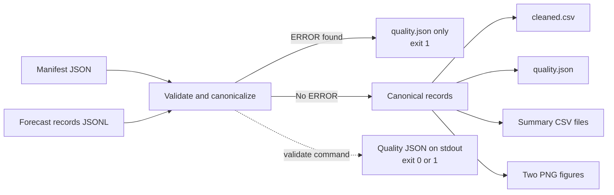
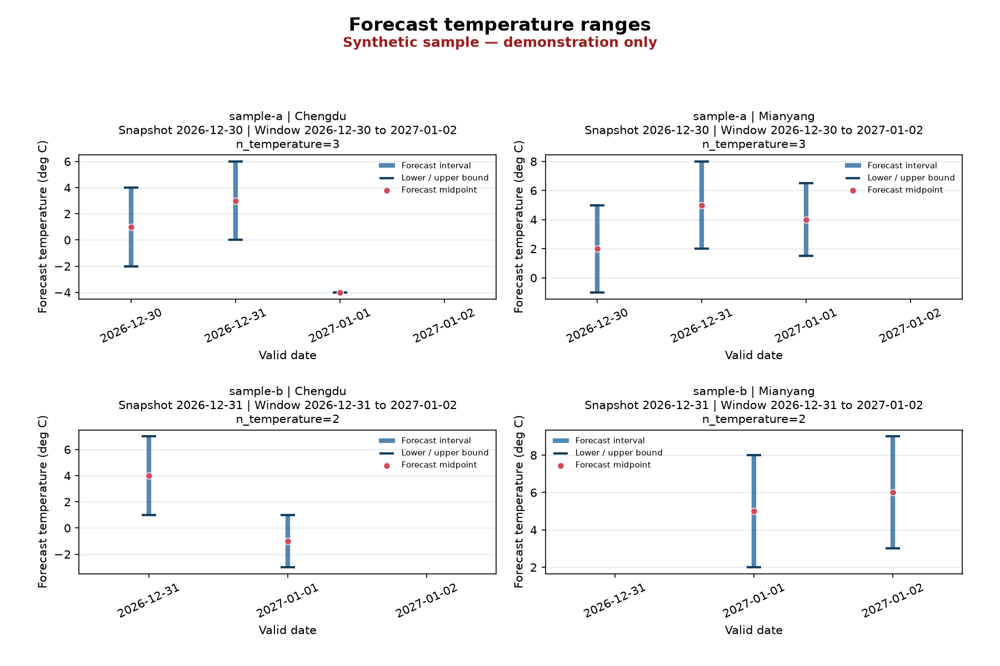
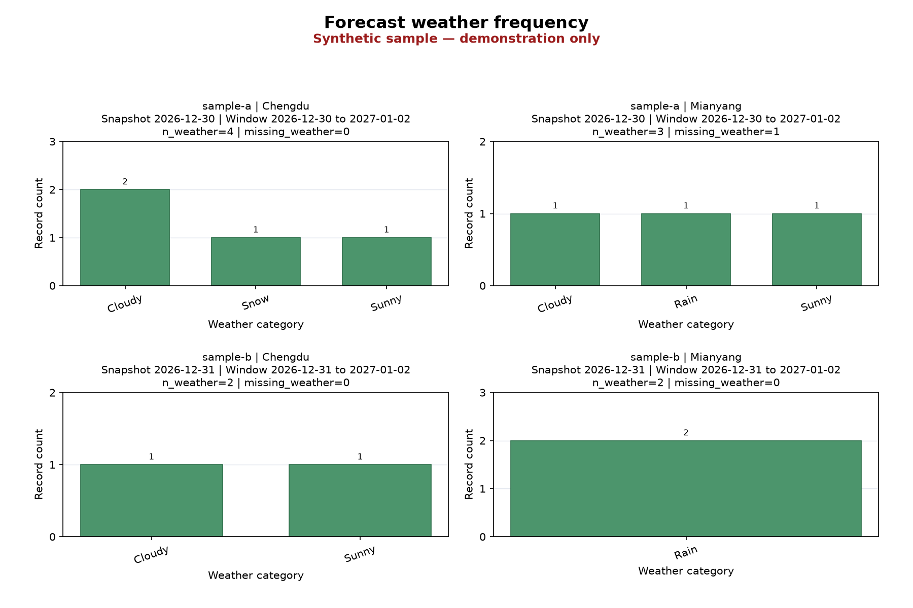

# Sichuan Weather Pipeline

A reproducible, offline-capable Python pipeline for cleaning, validating,
summarizing, and visualizing weather-forecast snapshot data.

> **Synthetic sample:** The repository sample is hand-authored synthetic data.
> It represents input structure, transformation scenarios, and edge cases only.
> It is not a statistically representative account of Sichuan weather or a
> source of real climate or historical observations.

## Highlights

- Strict manifest and JSONL validation with stable Q01-Q13 quality rules
- Deterministic date, text, temperature, duplicate, and conflict handling
- Explicit missing-temperature, missing-weather, and missing-month semantics
- Descriptive snapshot and monthly summaries with fixed output precision
- Temperature-range and weather-frequency visualizations
- Repeatable tests, hash-locked target dependencies, and offline acceptance tooling

## Pipeline workflow



The pipeline itself makes no network calls. "Offline-capable" means execution
and validation can run without a network after the package and dependencies are
installed. A disconnected installation requires a wheelhouse prepared in
advance for the target Python environment; dependency wheels are not bundled in
this repository.

## Quick start

Python 3.12 or 3.13 is required. After creating and activating a virtual
environment:

```console
python -m pip install .
weather-pipeline validate --input data/sample/records.jsonl --manifest data/sample/manifest.json
weather-pipeline run --input data/sample/records.jsonl --manifest data/sample/manifest.json --output output/sample
```

`validate` writes the quality document to standard output and creates no
artifacts. `run` requires a new or empty output directory. Exit codes are `0`
for valid data, `1` for completed validation with errors, `2` for CLI/path
contract errors, and `3` for runtime or I/O failures.

## Sample input and output

One synthetic JSONL record:

```json
{"location":" Chengdu ","snapshot_id":"sample-a","forecast_date_raw":"12-30\n星期三","temperature_raw":"-2～4℃","weather_raw":" Cloudy "}
```

Its canonical row, after deterministic merging with the equivalent duplicate:

```csv
location,snapshot_id,snapshot_date,valid_date,temp_min_c,temp_max_c,temp_midpoint_c,weather,source_lines
Chengdu,sample-a,2026-12-30,2026-12-30,-2.00,4.00,1.00,Cloudy,"[1,9]"
```

The full sample contains 14 input records, 12 eligible unique output records,
two merged duplicate rows, two missing-temperature records, one
missing-weather record, and one explicit missing month group.

## Validation semantics

The logical key is `(snapshot_id, location, valid_date)`. Unicode text is
normalized to NFC and surrounding whitespace is removed. Supported forecast
dates are resolved only within the manifest-declared valid window, and
temperature ranges use exact decimal arithmetic.

Format-equivalent records with the same logical key and normalized business
values are merged and reported as Q09. If any normalized temperature bound or
weather value differs within a key group, Q10 excludes the entire group.
Missing temperature and weather values remain missing: they are never replaced
with zero or imputed. Descriptive metrics and weather proportions use only the
corresponding non-missing values. Manifest-declared month groups with no records
remain explicit in monthly output and quality reporting.

See [the data-contract summary](docs/data-contract.md) for fields and all
Q01-Q13 rules.

## Generated artifacts

| Artifact | Purpose |
|---|---|
| `cleaned.csv` | Canonical, ordered records with source-line provenance |
| `quality.json` | Validation status, counts, hashes, issues, and missing groups |
| `summary.csv` | Descriptive metrics by snapshot and location |
| `monthly_summary.csv` | Descriptive metrics for every manifest-defined month group |
| `weather_frequency.csv` | Non-missing weather counts and proportions |
| `figures/temperature-ranges.png` | Temperature intervals and midpoints |
| `figures/weather-frequency.png` | Weather-category frequencies |





Both figures are generated from the repository's synthetic sample and visibly
identify themselves as demonstration-only material.

## Reproducibility and tests

The test suite covers parsing, contract validation, analysis, serialization,
CLI behavior, atomic delivery, visualization, artifact checking, packaging,
wheelhouse preparation, and repeat-run byte identity.

```console
python -m pip install ".[test,reproducibility]"
python -m pip check
python -m pytest --import-mode=importlib -p no:cacheprovider -ra tests
```

| Validation target | Public status |
|---|---|
| Windows x64 / CPython 3.12 local offline acceptance | PASS |
| Windows x64 / CPython 3.13 local offline acceptance | PASS |
| Linux validation | Linux x64 / CPython 3.12 and 3.13 validated in GitHub-hosted Ubuntu with committed hash locks and a network-isolated validation phase. |
| Hosted GitHub Actions | Windows x64 and Ubuntu x64 / CPython 3.12 and 3.13 completed the full hosted workflow and its same-run cross-target comparison. |
| Git-mirror fresh-clone acceptance | PENDING |
| Publication acceptance | PENDING |

For dependency locking, wheelhouse preparation, deterministic-output scope,
and the offline methodology, see [Reproducibility](docs/reproducibility.md).

## Limitations

This project processes provided forecast snapshots. It does not predict
weather, model climate, provide a real historical weather database, collect
data, crawl websites, or operate as a production scraping platform. The sample
is intentionally small and synthetic, so its summaries demonstrate pipeline
behavior rather than Sichuan climate statistics.

## Project structure

```text
data/sample/           Synthetic manifest and JSONL records
docs/                  Public contract and reproducibility documentation
reproducibility/       Explicit candidate-file allowlist
requirements/          Compatibility baseline and target-specific locks
scripts/               Wheelhouse, artifact, and offline acceptance tools
src/sichuan_weather/   Pipeline package
tests/                 Contract and packaging tests
```
